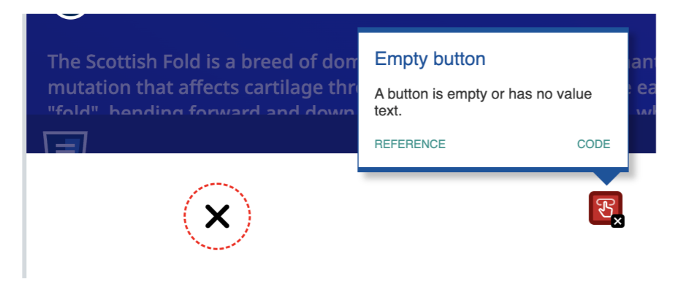

## Code Review Exercise

### Issue #1: Accessibility

The issue, why this is an issue, and the solution:

The accessibility issue is the "empty button" issue, meaning that the button is either empty or has no value text. A button should also have a value. However sometimes, we might use a glyphicon such as "x" to indicate this button is meant to close the popup modal. To fix this issue, we can add an "aria-label" attribute. It's also a good idea to add the "title" attribute, which will show the "title" of the image as a tooltip when the user hovers over the image.



Initial code:

```html
<button class="close-popup-button">
  <i class="fa-solid fa-xmark"></i>
</button>
```

Updated code:

```html
<button
  class="close-popup-button"
  title="close popup button"
  aria-label="close popup button"
>
  <i class="fa-solid fa-xmark"></i>
</button>
```

### Issue #2: Accessibility

The issue, why this is an issue, and the solution:

The submit and reset buttons are not functioning as expected because they are outside the `<form>` element. For form controls, such as submit and reset buttons, to work correctly, they need to be inside the `<form>` tag.

Initial code:

```html
<form id="RequestInfo" class="content-container form">
  <!-- other -->
</form>
<div class="form space-evenly-distributed-row-container form-buttons-container">
  <input class="form-button" type="submit" value="submit" />
  <input class="form-button" type="reset" value="reset" />
</div>
```

Updated code:

```html
<form id="RequestInfo" class="content-container form">
  <!-- other -->
  <div
    class="form space-evenly-distributed-row-container form-buttons-container"
  >
    <input class="form-button" type="submit" value="submit" />
    <input class="form-button" type="reset" value="reset" />
  </div>
</form>
```

### Issue #3: code refactoring

The issue, why this is an issue, and the solution:

Code that relies on DOM structures like event.currentTarget.parentElement.parentElement.parentElement may break if the HTML structure changes. If new elements are added to the HTML or existing elements are removed, this specific parent reference may no longer point to the correct element. This change improves the durability and maintainability of the code, making it more robust against future changes.

Initial code:

```javascript
const popupSection =
  event.currentTarget.parentElement.parentElement.parentElement;
popupSection.style.display = "none";
```

Updated code:

```javascript
const popupSection = event.currentTarget.closest(".popup-section-container");
if (popupSection) {
  popupSection.style.display = "none";
}
```

### Issue #4: Accessibility

The issue, why this is an issue, and the solution:

The contrast ratio between the background color, such as --darker-blue: rgb(25, 20, 101, 1);, and the text color, such as --blue: rgba(44, 21, 208, 1);, does not meet the minimum recommended contrast ratio by WCAG. It is recommended to have a contrast ratio of at least 4.5:1. Some colors need to be adjusted.


Initial code:

```css
.navbar {
  position: fixed;
  width: 100%;
  padding: 15px;
  background-color: var(--darker-blue);
  box-sizing: border-box;
}
```

Updated code:

```css
:root {
  --redd: rgb(255, 0, 0, 0.5);
}
.navbar {
  position: fixed;
  width: 100%;
  padding: 15px;
  background-color: var(--redd);
  box-sizing: border-box;
}
```
